# 最新免费大模型API哪里找？4步教你接入AI助手WorkBuddy（附手把手教程SOP）

大多数 AI 工具都支持接入自定义大模型 API。如果你正在找免费模型 API，阶跃星辰（StepFun）目前开放了限时免费领取活动：注册即送 15 天免费额度，API 接口与付费版完全一致，不绑卡、不需要实名认证。我自己实测从注册到接入 WorkBuddy 全程不到五分钟。

这篇文章把完整流程写出来，包括免费模型 API 怎么获取、怎么接入 AI 智能体、配置不通怎么排查，以及关于免费模型 API 的常见问题解答。

**本文目录：**

- 阶跃星辰免费模型 API 是什么
- 免费模型 API 怎么获取（注册三步流程）
- 免费大模型 API 怎么接入 AI 助手（以 WorkBuddy 为例）
- 配置不通？先查这 3 个地方
- 2 个注意事项
- 先跑起来，再决定要不要付费
- 关于免费模型 API 的常见问题

## 一、阶跃星辰免费模型 API 是什么

阶跃星辰（StepFun）是国产 AI 大模型公司，目前推出了 Step Plan 限时免费活动：新用户注册即可领取 15 天免费额度，API 接口与付费版完全相同。

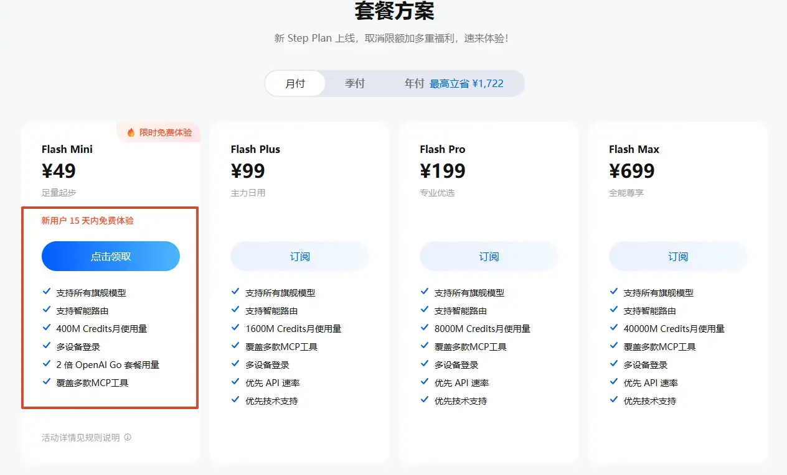
*图 1：阶跃星辰 Step Plan 免费模型 API 套餐方案，注册即领 15 天免费额度*

具体来说，你拿到的接口地址、调用方式、模型响应速度，跟付费版走的是同一条通道。区别只在于，你暂时不用付费。

两个关键信息：

> **免费时长：** 注册送 15 天，15 天内额度用完，系统自动再送 15 天，等于免费用将近一个月。

> **使用门槛：** 不绑卡、不实名认证、不付费。注册就能领，领完就能用。

日常办公场景——写周报、改文案、翻译、理思路——免费额度完全够用。

## 二、免费模型 API 怎么获取（注册三步流程）

获取阶跃星辰免费模型 API 一共三步：注册账号、领取免费额度、获取 API Key。全程不绑卡、不付费、不需要实名认证，快的话两分钟搞定。

### 第 1 步：注册账号

打开阶跃星辰开放平台，点击【免费领取】按钮：

> https://platform.stepfun.com/?invite_code=LTSLRHNS

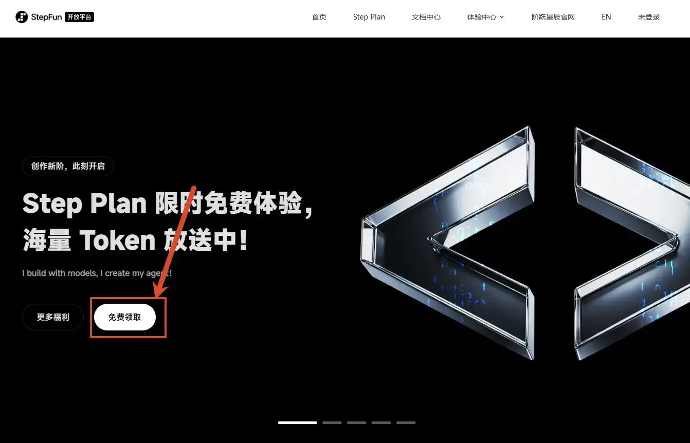
*图 2：阶跃星辰开放平台首页，点击【免费领取】注册免费模型 API*

跳转到套餐介绍页后，点击左侧【点击领取】按钮，用手机号注册一个账号。

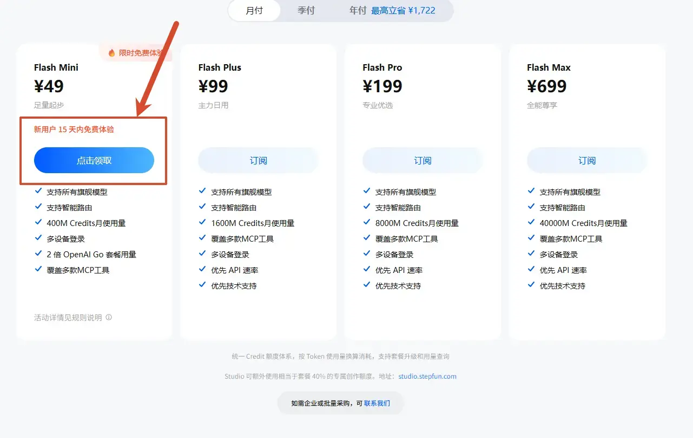
*图 3：免费模型套餐介绍页，点击左侧【点击领取】开始注册*

### 第 2 步：领取免费额度

注册完成后自动跳转 Step Plan 页面，往下滑找到免费套餐，再次点击【点击领取】。

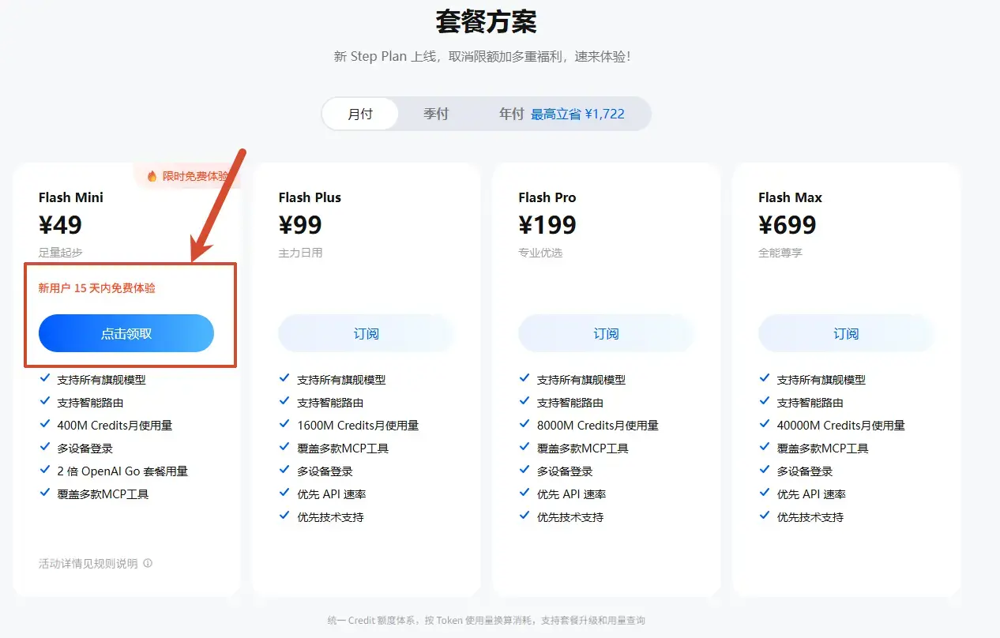
*图 4：Step Plan 页面，再次点击【点击领取】领取免费模型 API 额度*

新用户会弹出一个"Step Plan 限时免费体验"的活动弹窗，说明你的账号符合领取条件。勾选"我已阅读并同意"，点击【立即领取】。

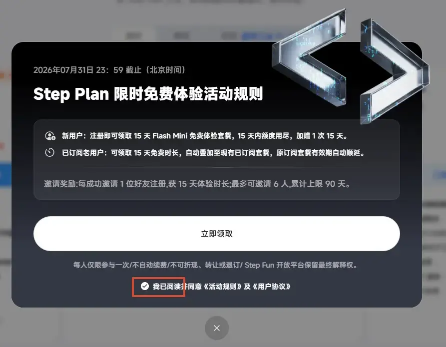
*图 5：免费体验活动弹窗，勾选同意后点击【立即领取】*

看到控制台显示【已生效】和截止日期，同时收到短信通知，就说明 15 天免费套餐已经生效了。

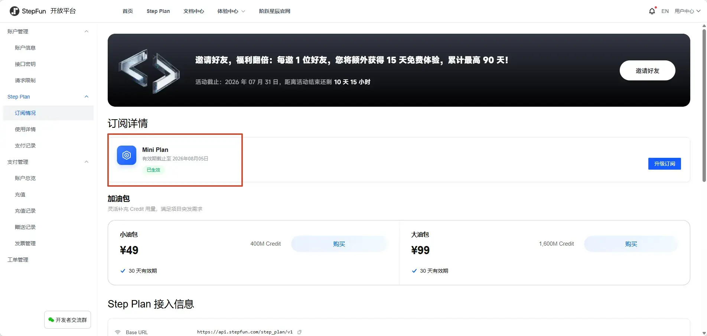
*图 6：免费模型 API 额度领取成功，控制台显示【已生效】及截止日期*

### 第 3 步：获取 API Key

在 Step Plan 页面继续往下滑，找到接口密钥区域。系统已经自动创建了一个"默认密钥"，直接复制即可。

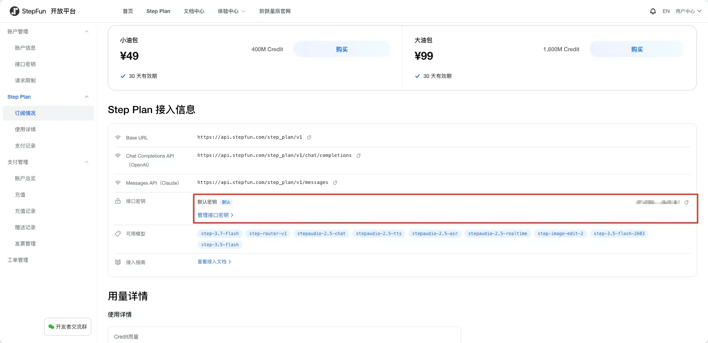
*图 7：免费模型 API 默认密钥（API Key），系统已自动创建，直接复制即可*

三步走完，手里就有一个可以直接调用的免费大模型 API 了。

## 三、免费大模型 API 怎么接入 AI 助手（以 WorkBuddy 为例）

拿到 API Key 之后，下一步是把它接入你日常使用的 AI 工具。这里以 WorkBuddy 为例演示。其他支持自定义模型的 AI 智能体（Codex、Claude Code、IMA、TARE Work 等）接入流程基本一致。

### 第 1 步：找到配置入口

打开 WorkBuddy，在对话框中点击模型选择区域，找到【配置自定义模型】入口。

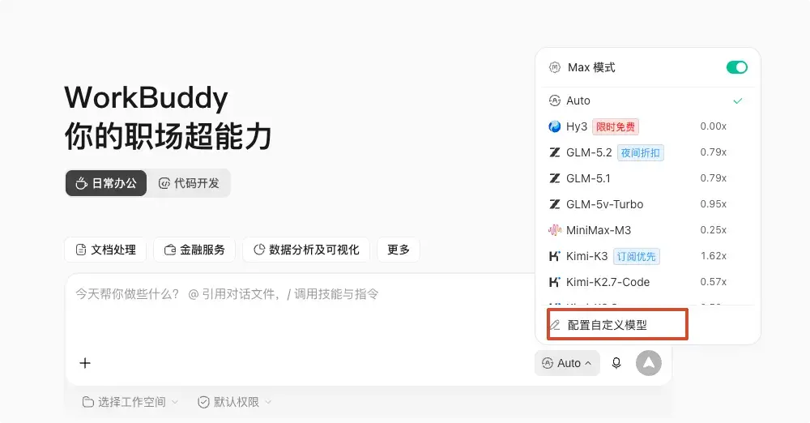
*图 8：WorkBuddy 配置自定义模型入口，接入免费大模型 API 的第一步*

### 第 2 步：填写 5 项配置

需要填写的配置项如下：

| 配置项 | 填写内容 |
|--------|---------|
| 供应商 | 拉到最底部，选择【自定义/Custom】 |
| 接口地址 | `https://api.stepfun.com/step_plan/v1/chat/completions` |
| API Key | 粘贴上一步在控制台复制的默认密钥 |
| 模型名称 | `step-3.7-flash`（阶跃星辰推荐的免费主力模型，多模态，支持图片和视频理解，支持三档推理强度） |
| 高级配置 | 勾选「图片输入」和「思考模型」，思考模式选低/中/高 |

保存前跟下面的配置截图核对一遍，确认无误后点击保存。

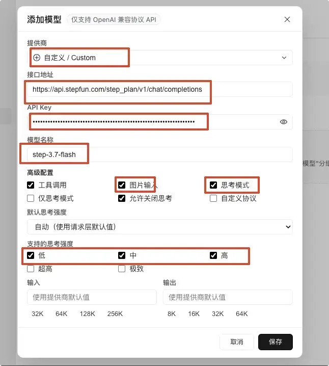
*图 9：免费模型 API 接入 WorkBuddy 最终配置（接口地址 + API Key + 模型名称 + 高级配置）*

### 第 3 步：验证是否接入成功

保存成功后返回 WorkBuddy 对话窗口，把模型切换到刚配置的免费模型。

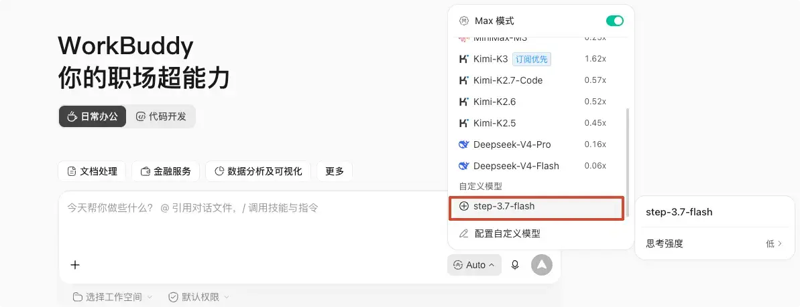
*图 10：在 WorkBuddy 中切换为刚配置的免费模型*

随便发一句话，比如"你好，介绍一下你自己"。能正常回复，就说明免费大模型 API 接入成功了。

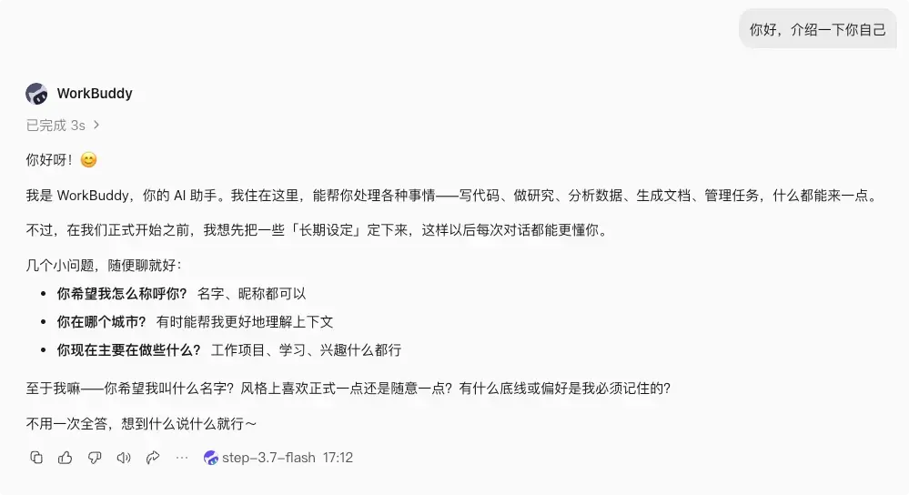
*图 11：免费大模型 API 接入成功验证，正常回复即表示配置完成*

## 四、配置不通？先查这 3 个地方

如果配置后模型没有响应或报错，大概率是以下三个原因，逐项检查即可：

**1. 接口地址是否完整复制。** 不能多空格、不能少字符，建议直接复制文中的地址。

**2. 模型名称大小写是否正确。** `step-3.7-flash` 全小写，模型名称区分大小写。

**3. API Key 是否粘贴正确。** 不要带空格，注意是控制台里的"默认密钥"，不是注册链接或登录地址。

把这三项重新复制粘贴一遍，基本就能解决。

## 五、2 个注意事项

### 免费活动截止时间

免费活动的截止日期是 **7 月 31 日**。但 API 使用期限是从你领取当天起算 15 天，不是 7 月 31 日统一截止。也就是说，如果你 7 月 31 日领取，最晚可以用到 8 月 15 日左右。15 天内额度用完，还会加赠一次 15 天。

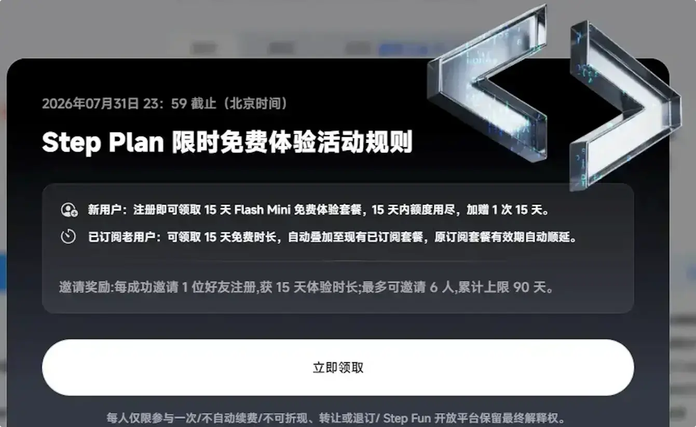
*图 12：免费模型 API 活动截止规则公告（7 月 31 日前注册有效）*

### 查看 API 调用详情

如果想确认自己确实在调用 step-3.7-flash 模型，可以在控制台查看使用详情。发一句话测试后，控制台就会显示调用次数和模型信息。

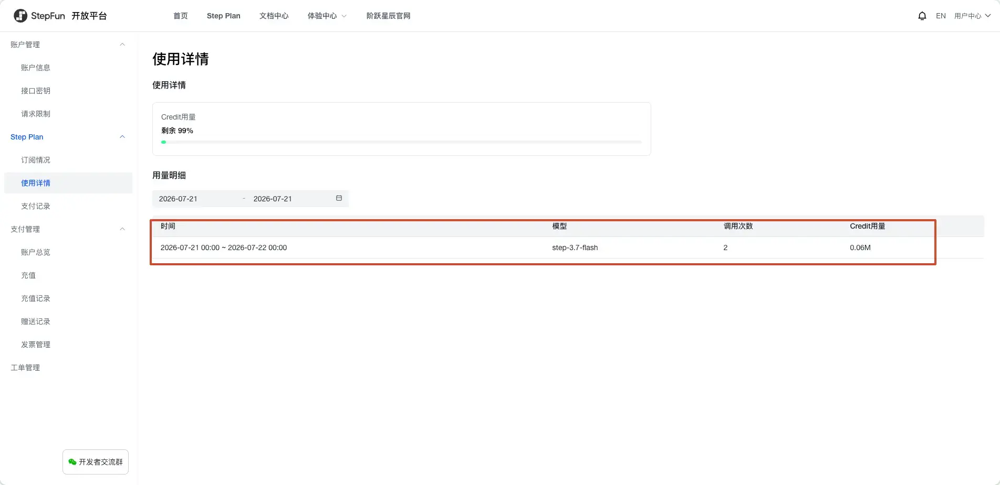
*图 13：控制台查看免费模型 API 调用详情，确认模型正常工作*

## 六、先跑起来，再决定要不要付费

不是掏不起那个钱，是在决定付费之前，得先搞清楚自己到底需不需要。

免费模型够不够用，取决于你拿它做什么。日常办公、写文案、翻译、理思路，免费额度完全 hold 得住。等真跑起来了，发现免费额度确实不够用，再考虑付费也不迟。

建议先用免费额度跑一两周，感受一下自己的实际使用频率和效果，再做决定。

## 七、关于免费模型 API 的常见问题

**1、免费模型 API 有额度限制吗？**

有。注册送 15 天免费额度，15 天内用完系统自动再送 15 天，合计约 30 天。额度用尽或到期后，需要付费或等待新一轮活动。

**2、免费模型 API 和付费版有什么区别？**

接口地址、调用方式、模型响应速度完全一致，走的是同一条通道。区别仅在于免费额度有上限，超出后需付费。

**3、免费模型 API 需要绑信用卡吗？**

不需要。不绑卡、不实名认证，手机号注册后直接领取。

**4、免费模型 API 够用吗？**

日常办公场景（写周报、改文案、翻译、整理思路）完全够用。高频调用或长文本处理场景建议先评估实际消耗量。

**5、免费模型 API 的活动什么时候截止？**

截止日期是 7 月 31 日，在此之前注册均可领取。API 使用期限从领取当天起算 15 天，不是活动截止日统一到期。

**6、除了阶跃星辰，还有哪些免费模型 API？**

市面上还有其他厂商提供免费额度，但各家免费额度、模型能力和限制条件不同。建议先明确自己的使用场景，再选择最匹配的方案。
